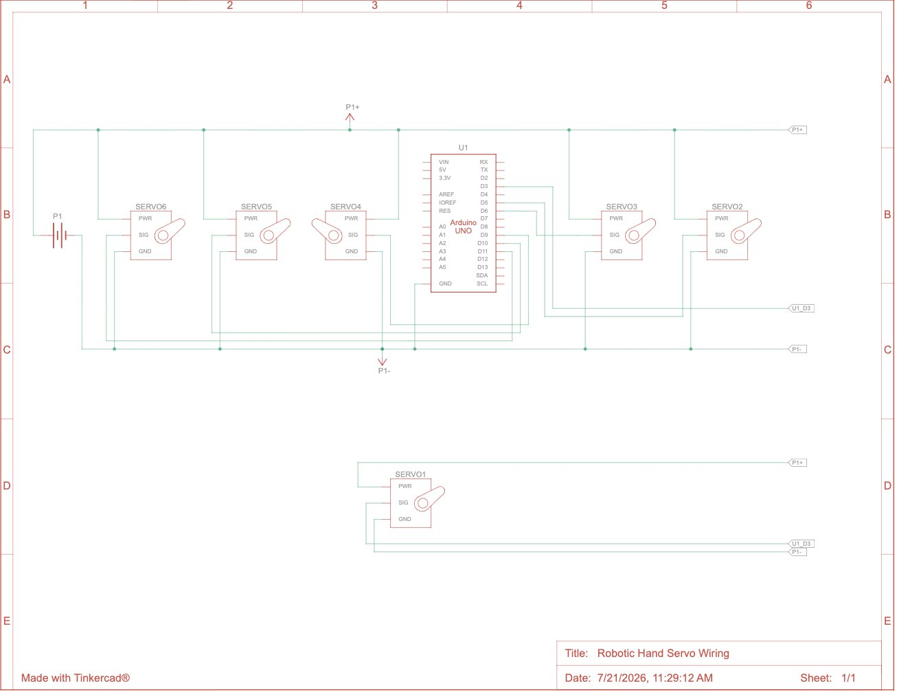

# Tendon-Driven Robotic Hand
This project is a robotic hand driven by servos attached to string tendons. The hand is controlled by a glove with flex sensors which sends numeric output to the robotic hand. The robotic hand then receives that numeric input and the computer converts it into motion by turning the servos, which flexes the tendons, eventually curling the fingers. The fingers return to their original position using springs.

You should comment out all portions of your portfolio that you have not completed yet, as well as any instructions:
```HTML 
<!--- This is an HTML comment in Markdown -->
<!--- Anything between these symbols will not render on the published site -->
```

| **Engineer** | **School** | **Area of Interest** | **Grade** |
|:--:|:--:|:--:|:--:|
| Sachin S | The College Preparatory School | Mechanical Engineering | Incoming Senior


  
# Final Milestone

**Don't forget to replace the text below with the embedding for your milestone video. Go to Youtube, click Share -> Embed, and copy and paste the code to replace what's below.**

<iframe width="560" height="315" src="https://www.youtube.com/embed/F7M7imOVGug" title="YouTube video player" frameborder="0" allow="accelerometer; autoplay; clipboard-write; encrypted-media; gyroscope; picture-in-picture; web-share" allowfullscreen></iframe>

For your final milestone, explain the outcome of your project. Key details to include are:
- What you've accomplished since your previous milestone
- What your biggest challenges and triumphs were at BSE
- A summary of key topics you learned about
- What you hope to learn in the future after everything you've learned at BSE


# Second Milestone

**Don't forget to replace the text below with the embedding for your milestone video. Go to Youtube, click Share -> Embed, and copy and paste the code to replace what's below.**

<iframe width="560" height="315" src="https://www.youtube.com/embed/y3VAmNlER5Y" title="YouTube video player" frameborder="0" allow="accelerometer; autoplay; clipboard-write; encrypted-media; gyroscope; picture-in-picture; web-share" allowfullscreen></iframe>

For your second milestone, explain what you've worked on since your previous milestone. You can highlight:
- Technical details of what you've accomplished and how they contribute to the final goal
- What has been surprising about the project so far
- Previous challenges you faced that you overcame
- What needs to be completed before your final milestone 

# First Milestone: 3D CAD Model of the Robotic Hand

<iframe width="560" height="315" src="https://www.youtube.com/watch?v=2uztZlgEYV8" title="YouTube video player" frameborder="0" allow="accelerometer; autoplay; clipboard-write; encrypted-media; gyroscope; picture-in-picture; web-share" allowfullscreen></iframe>

For this first milestone, I fully designed the 3D CAD model for the robotic hand. This involved a lot of different calculations and simulation to ensure that the joints moved smoothly together. This included designing 6 custom housings for the servos to sit it, creating individual fingers for tendons to run through and contract, and designing a rotating pivot that serves as an opposable joint for the thumb. One issue I faced and will continue to face is the accuracy of the 3D printer. A lot of my project relies on precision and accuracy, and since the 3D printer is only accurate down to 0.3mm, I had to account for that in the design process. This problem was especially prevalent in the first finger design, as the screw holes were too small and the pieces didn't slide across each other the way they should have. The next step in my project is to design the glove that will control the hand using numeric outputs from flex sensors.

# Starter Project: Mini Arcade Game

<iframe width="560" height="315" src="https://www.youtube.com/embed/sRoURtHjIgM?si=5XXycBBvE2cKAgB4" title="YouTube video player" frameborder="0" allow="accelerometer; autoplay; clipboard-write; encrypted-media; gyroscope; picture-in-picture; web-share" referrerpolicy="strict-origin-when-cross-origin" allowfullscreen></iframe>

For my starter project, I assembled the mini arcade game showcased in the video above. The game can either be powered by the battery pack on the back, or it can receive power from a cable. The majority of this project was soldering different parts, such as the buttons, LED displays, buzzer, and wires onto the provided microcontroller. In the beginning, I had some trouble with cleanly soldering the joints, however, once I got more practice the joints became cleaner and more efficient.

# Schematics 
Here's where you'll put images of your schematics. [Tinkercad](https://www.tinkercad.com/blog/official-guide-to-tinkercad-circuits) and [Fritzing](https://fritzing.org/learning/) are both great resoruces to create professional schematic diagrams, though BSE recommends Tinkercad becuase it can be done easily and for free in the browser. 


# Code
Here's where you'll put your code. The syntax below places it into a block of code. Follow the guide [here]([url](https://www.markdownguide.org/extended-syntax/)) to learn how to customize it to your project needs. 

```c++
void setup() {
  // put your setup code here, to run once:
  Serial.begin(9600);
  Serial.println("Hello World!");
}

void loop() {
  // put your main code here, to run repeatedly:

}
```

# Bill of Materials
Here's where you'll list the parts in your project. To add more rows, just copy and paste the example rows below.
Don't forget to place the link of where to buy each component inside the quotation marks in the corresponding row after href =. Follow the guide [here]([url](https://www.markdownguide.org/extended-syntax/)) to learn how to customize this to your project needs. 

| **Part** | **Note** | **Price** | **Link** |
|:--:|:--:|:--:|:--:|
| 1x Arduino Uno Rev3 | The Arduino Uno controls the several servos connected to the hand, controlling how much each tendon is pulled, and therefore how much the finger is flexed. | $33.98/unit | <a href="[https://www.amazon.com/Arduino-A000066-ARDUINO-UNO-R3/dp/B008GRTSV6/](https://store.arduino.cc/products/arduino-uno-rev3)"> Link </a> |
| 6x MG996R 55g Metal Gear Torque Digital Servo Motor | These servos wind up the rope tendons attached to the hand, thus flexing the fingers depending on the Arduino input | $26.98/6 units | <a href="[https://www.amazon.com/Arduino-A000066-ARDUINO-UNO-R3/dp/B008GRTSV6/](https://www.amazon.com/6-Pack-MG996R-Torque-Digital-Helicopter/dp/B0BMM1G74B/ref=sr_1_3_sspa?crid=3IKWW61WANINS&dib=eyJ2IjoiMSJ9.HAru7Zjv6UHS76wqocnm-ErEpMlnonBzf_eUh5W7RNvUrHls2zjpI0F_DoNHxF-fK-QlRjXKUjSMa7o-QTXBKMCWu1RmSX-sOaT1prqcz62W0yIse56Qm7Y9tGUQF_WWmry4C-ZXXhArFoEaVXY0BQNjELvotDWADWkDucvVhD_xvLzgeswbspKw5tzQa-IoUUnV63GiDsuzXNZyEqCkLYFrGq382CsHngjfbSLvdxdBi4WQkrTGy1mS-UWPbiX_Vs6ySAsIrPLCR2CZh77KeU57ojgUMXAdQkumfaIFeQ8.raG0zCHBuWMWZJhFQcTFXkhHhp5tzeqm2Wl5JAm4AXM&dib_tag=se&keywords=MG996R%2BHigh%2BTorque%2BServo%2BMotor&qid=1779668225&sprefix=mg996r%2Bhigh%2Btorque%2Bservo%2Bmotor%2Caps%2C163&sr=8-3-spons&sp_csd=d2lkZ2V0TmFtZT1zcF9hdGY&th=1)"> Link </a> |
| 6x Flex sensors | The flex sensors are used in the glove to sense how much the users hand flexes in order to assign that amount a number. This number is then sent to the Arduino, which tells the servos how much to rotate to mimic the movement in the glove. | $7.95/unit | <a href="https://www.amazon.com/Arduino-A000066-ARDUINO-UNO-R3/dp/B008GRTSV6/"> Link </a> |
| 1x Fishing Line | The fishing line is what the tendons are made out of. These wrap around a spool attached to the servo, and when the servo rotates, it coils the line around a spool. This shortens the length of the string, therefore shorting the length of the tendon which contracts the fingers. | $9.99/unit | <a href="https://www.amazon.com/Reaction-Tackle-Moss-Green-150yd/dp/B01JVKUOQ4/ref=sr_1_1_sspa?crid=CWJLB3QQXS70&dib=eyJ2IjoiMSJ9.spSYgmxS3aBQLGcgI8qqSND6lYKoo5c9t0eEj1RkZ3vsbY9JFpA1XS48fIZdkBaC3TRXt_AYzhegmP9JgNIt9SGjDHWPrYVPgxvMu-WWNlkvOEcApch8SicXKaOvuALK0-Pgu8FY20-OOlID8j4Tqv4ifdSFlYWDSRsCf3rQl3-2Y2rYV9cj5_bX6kAVxvqQFdLxi17_3j6JekQdpMnkrxit0V15Mu4NM-K769tW7IgW5VIwyG3IeBN959cb4TX3d1nNdo_eC554nMoQLOrexcDrd4zrjsg-Mh9R9txSoPk.1Ek9z79wp0B-gWKva3TtPKy-NWL7Dtgnse8zJL514Ac&dib_tag=se&keywords=braided%2Bfishing%2Bline&qid=1779670766&sprefix=briaded%2Bfishing%2Blin%2Caps%2C168&sr=8-1-spons&sp_csd=d2lkZ2V0TmFtZT1zcF9hdGY&th=1"> Link </a> |
| 15x 1in. Extension Springs | These lets the fingers return to their resting position when slack is given by the servos. Without these springs, I would have needed a second set of tendons and servos to control the movement back. | $6.99/ a lot of units | <a href="[https://www.amazon.com/PPFEITOU-Extension-Springs-Stainless-1-5inch/dp/B0G5836DQ5/ref=sr_1_2_sspa?crid=V1MU1RKJKXPE&dib=eyJ2IjoiMSJ9.PoFc8_AxlwHurG_ylaYqU8H2YhAP6OfO-lYuYwwxrfzvoDB4YsrLzsKHtnQ6YH_z5FwiNCqMoJiJGx8xl6jM3YJTM3lFCAuT9h56c-f3Q9yuheZHbvXAiKFl-AJ_9hlZyzuOm5Gt9WYMS4TEFxnx5pKVT9QVMjlR4yAJdLCCK2LH8Fx6vFR1lk630VdEjmlXRetsz5f5WQbuPJER1Tm370CdI-5XptwFtaMYR2_it2Q.b1M7i050pylIbhh0655zM2kc9kbzfww89oTYTHfuFgA&dib_tag=se&keywords=small%2Bextension%2Bsprings&qid=1779670847&sprefix=small%2Bextension%2Bsprings%2Caps%2C143&sr=8-2-spons&sp_csd=d2lkZ2V0TmFtZT1zcF9hdGY&th=1](https://www.amazon.com/PATIKIL-Extension-Diameter-Stainless-Tension/dp/B0FKB8PQBM/ref=sr_1_1_sspa?crid=1CDRQCVLC3WCI&dib=eyJ2IjoiMSJ9._op7TK2fk8w41L4MLuSrjKuFao7NCRWaUoHxHQ7UQMcFeGCINPndePGGD3kh64NELD9oL-ca5PXB140sg64YkFOJRqECejAJJowovjWyj394J5b4M3smy8HrJPeSkVzzBNSxY9UnVKOYxOKOgszmEWbpJNZeJWDh2x730xtIPuMBf6Ue8zZZSWNtNo5WSJOn3I1SBakJX7M0BwJwiwOoHHB1NhXnualQzsc_h7fvkig.lseB2_1tUejdVso3zRUiuXkGt3RwkFx7RXhJgDWDFXk&dib_tag=se&keywords=%2Bextension%2Bsprings%2B1%2Binch&qid=1784660965&sprefix=extension%2Bsprings%2B1%2Binc%2Caps%2C275&sr=8-1-spons&sp_csd=d2lkZ2V0TmFtZT1zcF9hdGY&th=1)"> Link </a> |
| PLA filament | PLA is the main material used for all of my 3D prints, and is great, because it is one of the cheapest filaments. | $22.53/spool | <a href="https://www.homedepot.com/pep/Wellco-1-16-in-Dia-8-in-W-White-3D-Printer-Filament-PLA-Materail-No-Tangling-for-3D-Printing-2-2-lbs-PF1751W/328385877?source=shoppingads&locale=en-US&fp=ggl&pla=&mtc=SHOPPING-BF-CDP-GGL-D25P-025_009_PORTABLE_POWER-NA-Multi-NA-PMAX-NA-NA-NA-NA-NBR-NA-NA-NA_PrioTest3BAU_National&cm_mmc=SHOPPING-BF-CDP-GGL-D25P-025_009_PORTABLE_POWER-NA-Multi-NA-PMAX-NA-NA-NA-NA-NBR-NA-NA-NA_PrioTest3BAU_National-20424844709--&gclsrc=aw.ds&gad_source=1&gad_campaignid=20283669755&gbraid=0AAAAADq61UfVEkXiHljmaz3ltFeowzXbZ&gclid=Cj0KCQjww8rQBhDjARIsAE43KPOKzSY06J5t-2UHtqE_EJNUQ1VfHEiH_-Wdc7XMCWrYA_ujNHCMMSkaAo6yEALw_wcB"> Link </a> |
| M3-0.5x16 Screws | Attaching several different parts of the hand together | $4.39 | <a href="[https://www.amazon.com/Arduino-A000066-ARDUINO-UNO-R3/dp/B008GRTSV6/](https://www.amazon.com/Machine-Stainless-Phillips-Hardware-Fastener/dp/B0FP8XMF9C/ref=sr_1_2?crid=28V8Q14Q9IU9T&dib=eyJ2IjoiMSJ9.LvGiWWJVOBKCWAG5tPJXgJhb0NMA8b8foX4DHW5Fk8QWuMrEVq0WOzVLt-uimobLhxyXEyZd3MJ13m5SGhr_mL0yhfYUD0qNYe6Nkr4M3q6-KTjp7vCsSHhuQjUy6wqtb3zsj5qAm3_zaUs7uvCKZd373JD9ODt_XtVkMfs-QQ3-lfapJJ4IQb75SXhJiTihr0s32lsUl4aos1aTdQyeYDkSwkQB5Qwjuw4yIhYrUhY.R4qXUluoULzTCLnZdyRLbmnRZDbanfSZtswNWPLXoKE&dib_tag=se&keywords=M3%2Bscrews%2B0.5x16%2Bphillips&qid=1784661094&sprefix=m3%2Bscrews%2B0.5x16%2Bphill%2Caps%2C485&sr=8-2&th=1"> Link </a> |
| M3-0.5 Hex Nut | Attaching several different parts of the hand together | $5.99 | <a href="https://www.amazon.com/Yinpecly-M3x0-5mm-Hexagon-Fasteners-Replacement/dp/B0F9FC4563/ref=sr_1_16?crid=X46W4ZMCHNYZ&dib=eyJ2IjoiMSJ9.HjH3Ga7QXfDbpuCt0giruePqi081VNBRxUYn-rUL53v6SsPCxjSZgmuX5V15vEE99G0vqV0i3rKHFTsDSJD1sfY0DggbkLsaihhNNNqcy8lFA4vGiN-zBZOzExWgxnoskJ5lnc-FFSapd1eLduhnADVGVqThY1XEDn4lOL05Tz_0qTD7Fpze-lUTrUqBIfoC3XGON6ynluEwefwAoiIgq_k_Ui56uO3ouwfbG_nwtYTog3SOh-rKM5EVO_TjqvXtcqp8Lk5oy8NcLiB5KOCj5rJRtTct9L7IrThjZxSbf2I.AhPRLHB_HlfrqCfe_-bnBKEXvjo7Q0FGovg-myBTmBY&dib_tag=se&keywords=M3%2B10.9%2Balloy%2Bsteel%2Bnuts&qid=1784661191&sprefix=m%2B10.9%2Balloy%2Bsteel%2Bnuts%2Caps%2C267&sr=8-16&th=1"> Link </a> |
| 6 Pin Bus Strips | These strips are used send power from the power supply to the 6 high torque servos. A typical breadboard would be unable to handle the current passing through the rails, and would subsequently melt. The bus strips are significantly stronger, and therefore are better suited to this project. | $9.99 | <a href="https://www.amazon.com/Tmyjfjingxi-Positions-Terminal-Insulated-WW004-2508/dp/B0D5XD1G1M"> Link </a> |
| 5V 15A Power Supply | This supplies power from a typical wall outlet to the servos. Each servo can require up to 2.5 amps, so with all 6 servos, we can get up to a current of 15 amps. Each servo requires 5 volts. | $19.99 | <a href="https://www.amazon.com/COOLM-5V-15A-Power-Supply/dp/B0DYNT3TLF"> Link </a> |
| DC Power Jack Female Connector | This is used to connect the power supply to the bus strips where the servos get power. | $3.97 | <a href="https://www.amazon.com/California-JOS-Male-Female-2-1x5-5mm/dp/B0CR8TZ41W/ref=sr_1_4?crid=3SGNI8IU5L86S&dib=eyJ2IjoiMSJ9.oERvPOoJhQ8N5OvmDasWcABOe1gAN5g4IpuSjzjt72B3DT69QbI5MXFHooflMHNk3jN4DV7iJagqCaYq1sHFJm_1ub18DbfBYBCxZS9_OqjmGf7TdwgYB6NIF4xJZBrkXgNtU0K2N6N_iSLltpHQIpN4yzwRt1vQ9iZ9DT4YW1c_mh0dWOnArlwIfz7DAg_kW29eulPdCO7fSLtbooKc5dO3F79YlFSDL2Up0Hf2wrchwWMwhTKOMwCIwUmk9pQwCLc_PDa-BfuHDjSr0U1lrCKt3aZYUACPl_LeC8MFAPk.zyHa-I8icz3XwPgrtSrffqewiYyXWNRYpZwSYbaBK8Y&dib_tag=se&keywords=dc%2Bconnector%2Bto%2B%2B_&qid=1784661621&s=electronics&sprefix=dc%2Bconnector%2Bto%2B%2B%2Celectronics%2C473&sr=1-4&th=1"> Link </a> |
| M1.5 Metal Dowel Pins | This is used as a pivot point for the fingers and also an attachment point for the springs on the fingers. | $5.79 | <a href="https://www.amazon.com/HARFINGTON-Stainless-Cylindrical-Furniture-Installation/dp/B0F6D17R3R/ref=sr_1_4?crid=2YPD9KPCHKFM2&dib=eyJ2IjoiMSJ9.VsynPj-809zw_D1zUrg3O4jFe_zkEfXzucLyDuFcbwAsmx2OEevPCrfQHP6y3rrZ_r3KNHaw0TcBK_e28cprgMhZXL-N2Fmy_wS9el_vrepjM4znC5lkc7jiiFt4hwypCFZysMGvCVwlMKWLCBpAgf3Fu4OIPzVG2uNCVWTuoHLP3cJWPs8-wKyws1r2R29WxqLlHJdjiFPtX-6QYMpMzqoVTZfVMZ5m3llSfddo4_A.fDYzblbJAnwkgwJrAkKojm62FRedxiixXf_tBECYGyI&dib_tag=se&keywords=1.5mm%2Bmetal%2Bpins&qid=1783024320&sprefix=1.5mm%2Bmetal%2B%2Caps%2C483&sr=8-4&th=1"> Link </a> |
| Super Glue | Used for attaching certain parts such as the spools together. | $8.48 | <a href="https://www.amazon.com/Fast%E2%80%91Setting-Impact%E2%80%91Tough-All%E2%80%91Purpose-Adhesive-Anti-Clog/dp/B08QQZ71CV/ref=sr_1_3?crid=2SVGPLA48MEIT&dib=eyJ2IjoiMSJ9.prPOkHbbdtLPxn3mgR2TV8N48BgvxwLcQpvExS2lp1TKOWeZGKznQSDtCdLpvBcln6_bDYthVzbLNgXrdNOWCMASw6bsN8O9UnXJI_h7aRN8BMsZ2r2Ilh641i-7ucZaX-B8Ttfn5qYu3QHcd1RirEsHcyY9Xa2vlcgQlcQCsGwTo2swQUSdAsA9dVxzgZrcePElQKJhlQOetdNP9LoqNJF6-QBWSEIZwdzUCmV1zLQ.cENgg6tSPUVz2coFMRS6j1rkCWZWEO0ncFMHO9I8TD4&dib_tag=se&keywords=gorilla%2Bsuper%2Bglue&qid=1784662142&sprefix=gorilla%2Bsuper%2Bgl%2Caps%2C223&sr=8-3&th=1"> Link </a> |
| Item Name | What the item is used for | $Price | <a href="https://www.amazon.com/Arduino-A000066-ARDUINO-UNO-R3/dp/B008GRTSV6/"> Link </a> |
| Item Name | What the item is used for | $Price | <a href="https://www.amazon.com/Arduino-A000066-ARDUINO-UNO-R3/dp/B008GRTSV6/"> Link </a> |
| Item Name | What the item is used for | $Price | <a href="https://www.amazon.com/Arduino-A000066-ARDUINO-UNO-R3/dp/B008GRTSV6/"> Link </a> |
| Item Name | What the item is used for | $Price | <a href="https://www.amazon.com/Arduino-A000066-ARDUINO-UNO-R3/dp/B008GRTSV6/"> Link </a> |

# Other Resources/Examples
- [Eth](https://srl.ethz.ch/platforms/srh/biomimetic-tendon-driven-hand.html)
- [ResearchGate](https://www.researchgate.net/figure/A-linkage-tendon-hybrid-driven-anthropomorphic-robotic-hand-MCR-Hand-II_fig1_334852568
)
- [Github](https://github.com/TetherIA/aero-hand-open/blob/main/hardware/Assembly/Tools.csv)
- [Servo Guide](https://www.circuitbasics.com/controlling-servo-motors-with-arduino)
